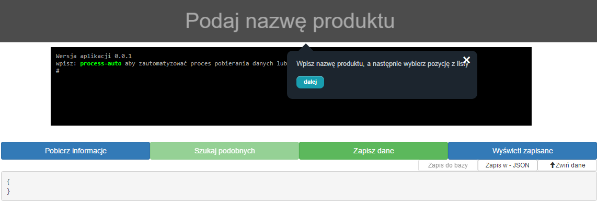

Dokumentacja użytkownika

Projekt ETL

Przedmiot: Hurtownie Danych

Andrzej Piszczek

Mikołaj Sikorski

Jakub Doskocz

Damian Skakuj

> 1. Uruchomienie i pierwsze wyszukanie produktu

Po przejściu na stronę aplikacji ([http://v-ie.uek.krakow.pl/~s174644/app_dev.php](http://v-ie.uek.krakow.pl/~s174644/app_dev.php)) użytkownik może zobaczyć layout programu.

Przy pierwszej wizycie na podanej stronie aktywowane są "dymki", które wyjaśniają użytkownikowi jak powinien korzystać z aplikacji. Górna belka strony jest miejscem gdzie użytkownik musi wpisać poszukiwany przedmiot, a następnie wybrać go z rozwijanej listy, jak na poniższym obrazku.

Po wyborze poszukiwanego przedmiotu użytkownik może zauważyć kolejne etapy działania programu na konsoli poniżej belki do wpisywania poszukiwanego przedmiotu.

Również w tym miejscu pojawiają się "dymki" objaśniające działanie aplikacji. Są one jednak jedynie podczas pierwszego uruchomienia aplikacji. Aby przy kolejnej próbie skorzystania z niej można je było zobaczyć należy usunąć ciasteczka. 

Użytkownik dodatkowo może ukryć nie interesujące go parametry klikając na miejsce przed otwierający nawiasem (będzie ono zaznaczone poprzez zmianę kursora myszki).

Sytuacja przed kliknięciem:

Sytuacja po kliknięciu:

Aby rozwinąć dany parametr należy kliknąć w miejsce pomiędzy klamrami.

2. Pobranie danych o wybranym produkcie

Aby pobrać szczegółowe dane o produkcie należy wybrać pierwszy przycisk z belki poniżej konsoli "Pobierz informacje".

Pobrane przez użytkownika dodatkowe informacje ukryte są pod nazwą parametru "more" poniżej wcześniej wyświetlonych parametrów ogólnych.

3. Szukanie podobnych produktów w innych serwisach

Drugi przycisk w belce pod konsolą pozwala użytkownikowi poszukać podobnych produktów w innym serwisie, który w tym przypadku jest serwisem skąpiec.pl. Dodatkowo wszystkie informacje są zapisywane ponownie w konsoli, dlatego użytkownik może kontrolować co wykonała aplikacja.

W tym przypadku, jak można odczytać z konsoli, aplikacja pominęła dwa produkty, gdyż były odnośnikami do zewnętrznego sklepu, stąd wyświetliły się jedynie 3 produkty. Klikając w przycisk "Ładuj komentarze", do wcześniej pobranych z ceneo.pl zostaną dołączone te ze skąpca (skąpiec.pl). 

4. Zapis i wyświetlanie danych

Tak pobrane dane możemy zapisać do bazy danych, bądź do pliku o rozszerzeniu .json bądź .xml. Wybór tego formatu jest dokonywany przez wybranie przycisku "Zapis w JSON", który spowoduje zmianę go w przycisk "Zapisz w XML". Dane zapisywane są poprzez przycisk "Zapisz dane". Po wybraniu go automatycznie zostaje pobrany na nasz komputer odpowiedni plik.

Jeśli użytkownik zdecyduje się do zapisania produktu do bazy danych wraz ze wszystkimi parametrami można będzie je zobaczyć wybierając przycisk "Wyświetl zapisane". 

Przechodząc do tego okna można wyczyścić bazę danych, kiedy produktów jest zbyt wiele klikając w "Wyczyść bazę danych" oraz powrócić do wcześniejszego ekranu. Jeśli jednak użytkownika interesuje jakie dane zostały umieszczone w bazie danych może je przejrzeć przyciskając "Pokaż". Kiedy dane nie będą już przydatne można usunąć pojedyncze produkty przyciskając "Skasuj". 

5. Dodatkowe funkcjonalności aplikacji

Pierwszą z dodatkową funkcją jest dynamiczna konsola, która pozwala użytkownikowi na korzystanie jak ze zwykłej konsoli, jak chociażby wyświetlanie alertów.

Drugą dodatkową funkcjonalnością jest pasek postępu podczas ładowania komentarzy.

Ostatnią z dodatkowych rzeczy jest możliwość zwijania wszystkich wyświetlonych danych o danym produkcie poprzez przycisk 'Zwiń dane".

